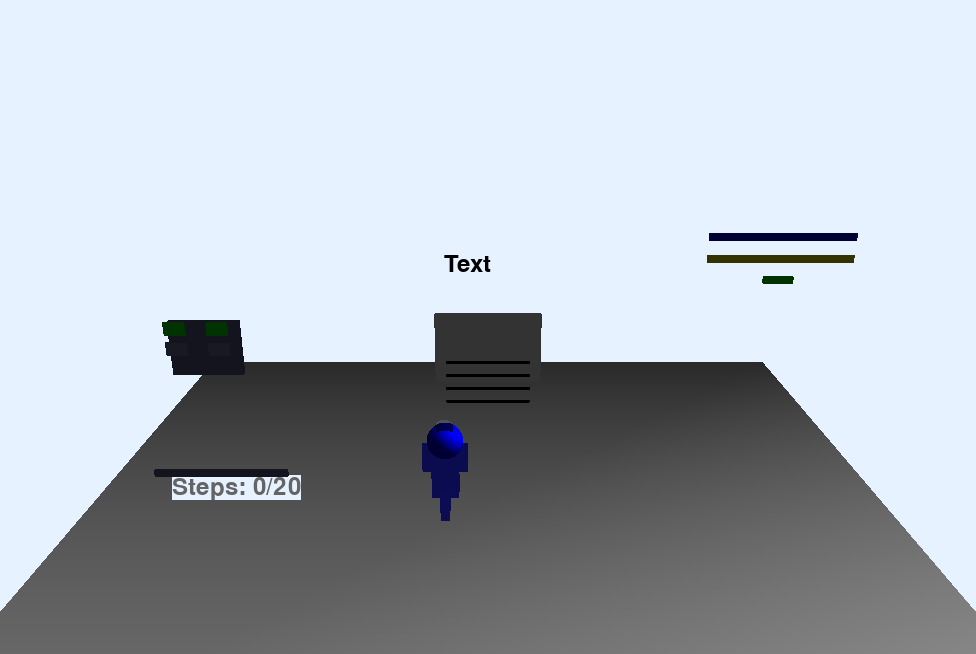

# AccessLearn Navigator: RL for Educational Accessibility

This project uses reinforcement learning to create intelligent assistive technology for African learners with disabilities. It simulates an environment where an AI agent learns to provide appropriate learning assistance to students with visual impairments.

## Project Overview

The AccessLearn Navigator is an intelligent assistant that learns to provide appropriate support for students with visual impairments accessing educational content. The agent must learn optimal strategies for different types of content, levels of visual impairment, and available assistive devices.

### Environment Features

- Various educational content types (text, diagrams, charts, videos, interactive)
- Different levels of visual impairment
- Various assistive devices (screen readers, braille displays, etc.)
- Realistic constraints (time, attention/energy resources)
- Reward system based on student understanding and engagement

### Implementation

This project implements and compares two reinforcement learning approaches:
- Deep Q-Network (DQN) - a value-based method
- Proximal Policy Optimization (PPO) - a policy gradient method

## Environment Visualization



The environment is visualized using PyOpenGL, showing:
1. The student (blue figure)
2. Educational content (varies by content type)
3. Available assistive devices (green = available, gray = unavailable)

## Installation

```bash
git clone  https://github.com/elvisguybakunzi/elvis_bakunzi_rl_summative
cd elvis_bakunzi_rl_summative
pip install -r requirements.txt
```

## Project Structure

```
project_root/
├── environment/
│   ├── custom_env.py        # Custom Gymnasium environment for the AI assistant
│   ├── rendering.py         # 3D visualization using PyOpenGL
│   └── env.png             # Environment visualization
├── training/
│   ├── dqn_training.py      # Training script for DQN using SB3
│   ├── pg_training.py       # Training script for PPO using SB3
├── models/
│   ├── dqn/                 # Saved DQN models (e.g., final_model.zip)
│   └── pg/                  # Saved PPO models (e.g., final_model.zip)
├── metrics_analysis/
│   ├── cumulative_reward_comparison.png  # Cumulative reward comparison between DQN and PPO
│   ├── Stability_Comparison.png   # Stability comparison between DQN and PPO
│   ├── dqn_metrics.csv          # Metrics analysis results for DQN
│   ├── ppo_metrics.csv          # Metrics analysis results for PPO
├── main.py                  # Main script to train or play models
├── metrics_analysis.py      # Script to evaluate trained models and log metrics
├── requirements.txt         # Project dependencies
└── README.md                # This file
```

## Prerequisites
- **Python**: 3.8+
- **Dependencies**: Listed in `requirements.txt`

Install dependencies using:
```bash
pip install -r requirements.txt
```

## Setup and Running Instructions
### 1. Clone the Repository
```bash
git clone  https://github.com/elvisguybakunzi/elvis_bakunzi_rl_summative
cd elvis_bakunzi_rl_summative
```

### 2. Run the Main Script

- Train Models
Train DQN and PPO models using main.py. Models will be saved in models/dqn/ and models/pg/.

### Train DQN:


```bash
python main.py --train dqn
```
### Train PPO:

```bash
python main.py --train ppo
```


## 3. Play Trained Models

Visualize the trained models in the 3D environment:

### Play DQN:

```bash
python main.py --play dqn
```
### Play PPO:

```bash
python main.py --play ppo
```

### Custom Model Path (if saved elsewhere):

```bash
python main.py --play dqn --model_path models/dqn/final_model.zip
```

Controls: Press ESC to exit, SPACE to reset an episode early.

## Evaluate Metrics

Analyze trained models’ performance (Cumulative Reward, Stability, Convergence, Generalization) using evaluate_metrics.py. Results are saved in `metrics_analysis/`.

Evaluate Both Models:

```bash
python metrics_analysis.py
```
